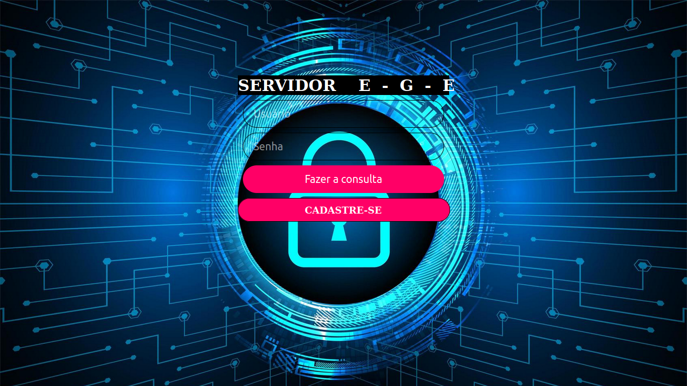

# CURSO TÉCNICO EM INFORMÁTICA 

### - INFORMATIVO
- O projeto foi desenvolvido para avaliação final em linguagem de programação no curso Técnico. 
- Um CRUD, usando HTML, CSS, PHP e MYSQL.
- Foi realizado com base em exemplos de códigos que foram sendo atualizados e implementados os requistos do projeto ao decorrer do desenvolvimento.
- O projeto antes de ser publicado no GITHUB, apenas foi realizado verificação de funcionamento sem modificações da interface ou alteração do código.

### - OBJETIVO
- Publicar a versão inicial do meu projeto escola.
- Leia o arquivo Projeto.md

### - DETALHES
- SERVIDOR-E.G.E 
- Projeto de Março de 2021 
- Equipe: Erimilson, Geisiele, Eloiza
- Curso: Técnico em Informática para Internet 
- Turma: 2019.1
- Publicação no GITHUB : 18/02/2022 

### - ALTERAÇÕES

- Foi criado um Readme.md
- Adicionado uma lincença.
- Por motivos de privacidade e segurança foi editado os nomes dos desenvolvedores.

### - INTERFACE DO PROJETO

### Tela Inicial

### Página do CRUD

